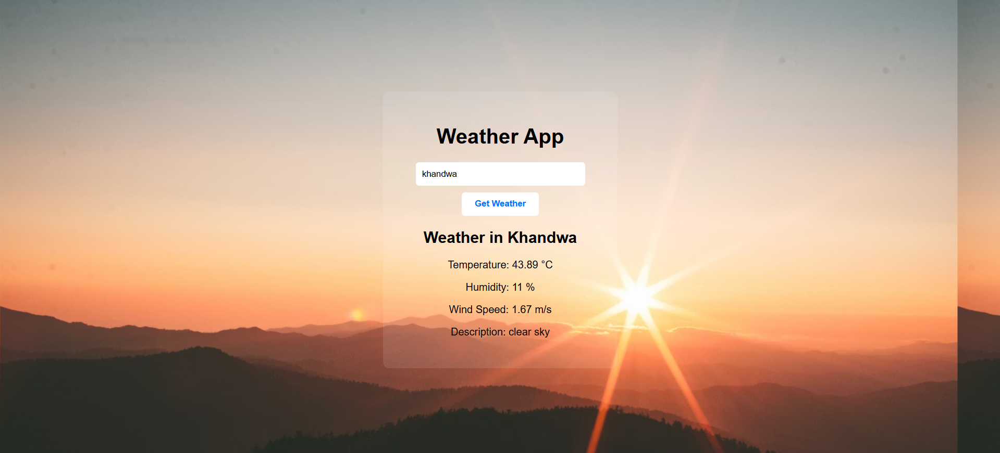

# 🌦️ SkyCast - Weather Forecast Web App

SkyCast is a modern and responsive weather forecast web application developed using HTML, CSS, and JavaScript.  
The application provides real-time weather information such as temperature, humidity, wind speed, 
and weather conditions for different cities around the world using the OpenWeatherMap API.

## ✨ Key Features

- 🌍 Search weather by city name
- 🌡️ Real-time temperature updates
- 💨 Wind speed information
- 💧 Humidity details
- 🌤️ Dynamic weather backgrounds
- ❌ Invalid city error handling
- 📱 Responsive user interface
---
## 🛠️ Technologies Used

- HTML5
- CSS3
- JavaScript (ES6)
- OpenWeatherMap API

---

## 📸 Project Preview

---
